# Teamwork Management App

 ## Usage and features

 TeamTasker is an app designed to create teams and organize any type of activity: study groups, trips, or work projects. Users can create both individual and shared tasks and communicate in real-time among team members to coordinate effectively.
   - The first time you access the app, you must create an account by entering an e-mail address and password. Then you must choose your nickname and optionally upload a photo. If you already have an account, you can of course log in with your credentials.

  

    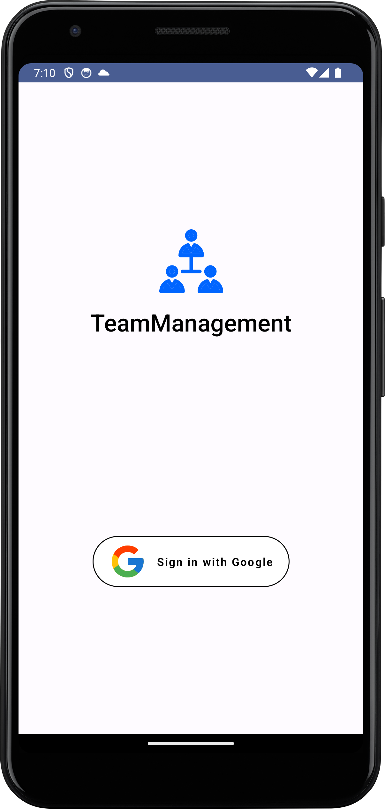
  

- Once logged in, you will see the homepage, which consists of the various teams you belong to. At the bottom, there will always be a navigation menu for quick access to the main pages in addition to the home: My Tasks, Chat, and Profile. Additionally there is a floating button with a for creating a new team, task or chat. At the top, a QR code button allow the user to invite other people joining teams.

  

    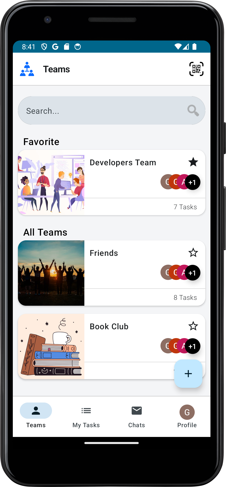
    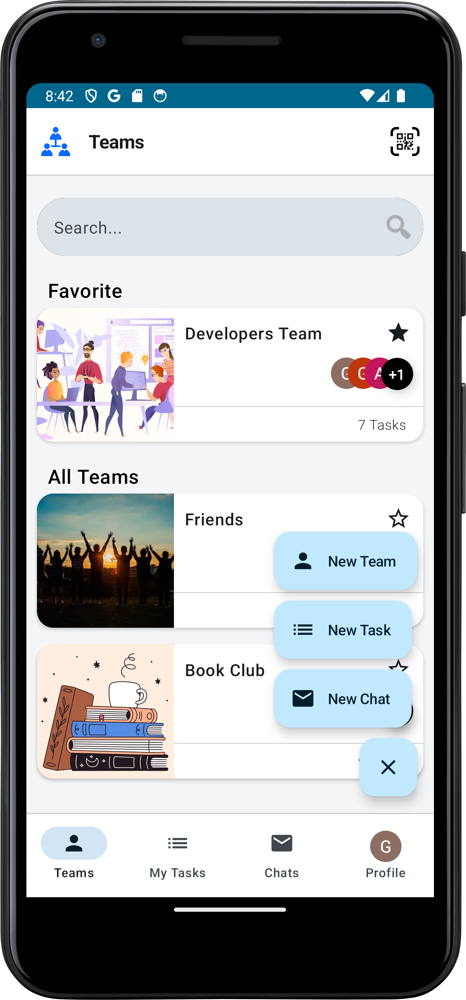
    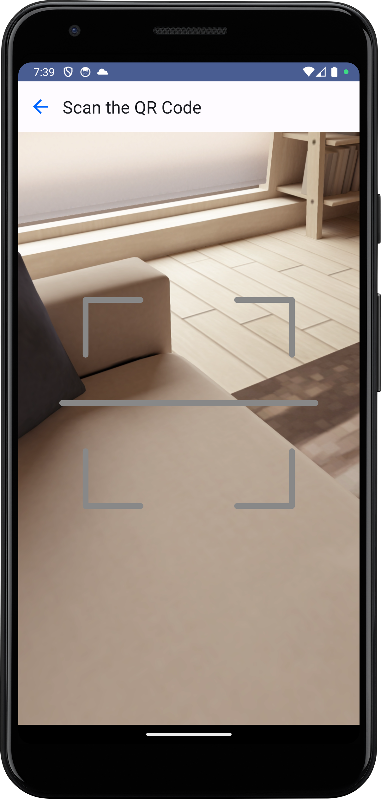
  

- In the Home (Teams section), you can see all the teams you belong to, with favorite teams appearing at the top. By opening a team, you can view its tasks, categorized by status (Pending, In progress, Completed, Deleted), information about team members. If you are an admin of the team, you also have the ability to modify the roles of members or remove them.

  

    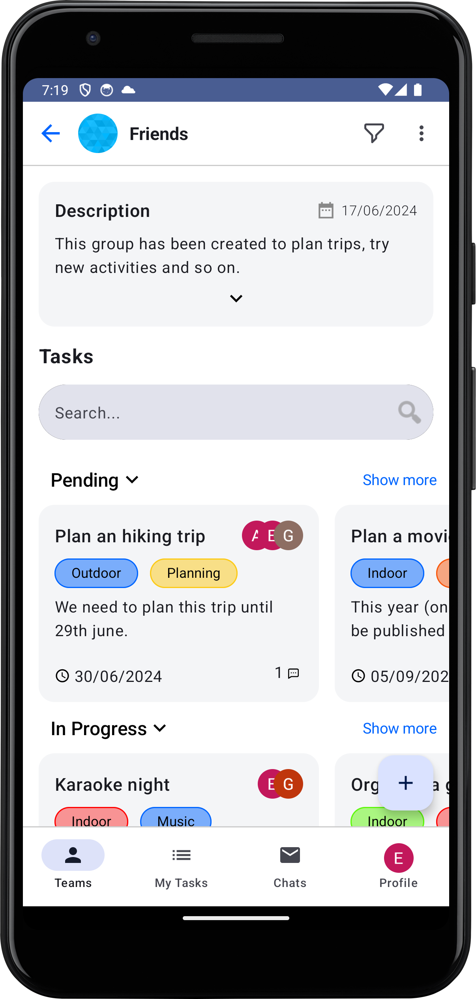
    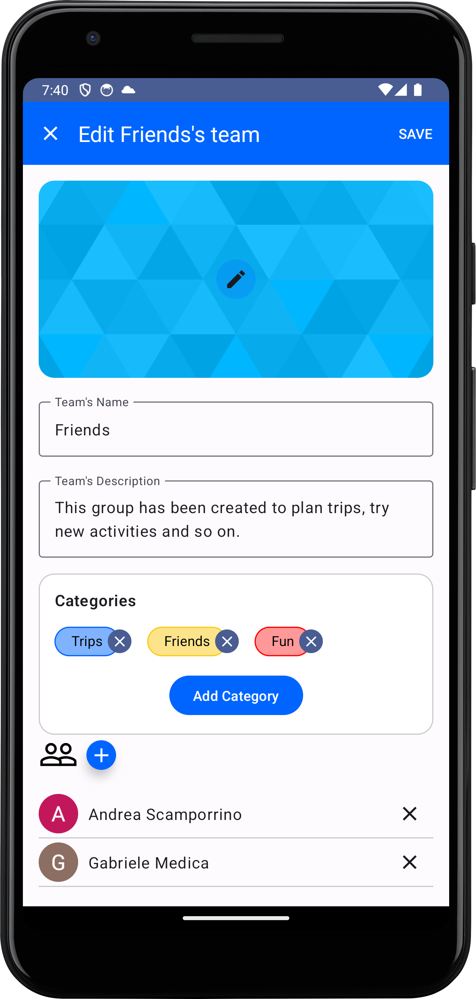
  

- In the "My Tasks" section, you can view all your tasks separated by team, with the option to filter them. By opening a task, you have the opportunity to modify its characteristics (status, category, description, frequency, etc.) or delete it.

  

    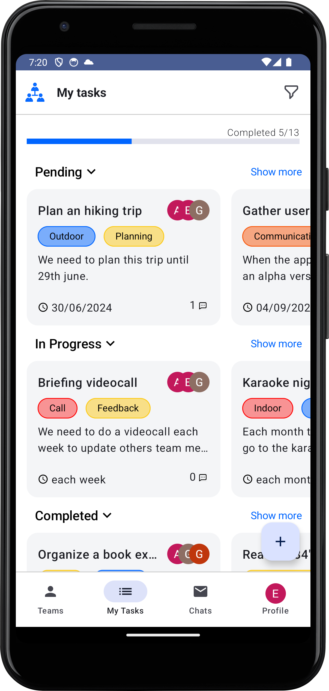
  

  
- By selecting a task, you can view all the details (title, description, tags ...)
  
  

    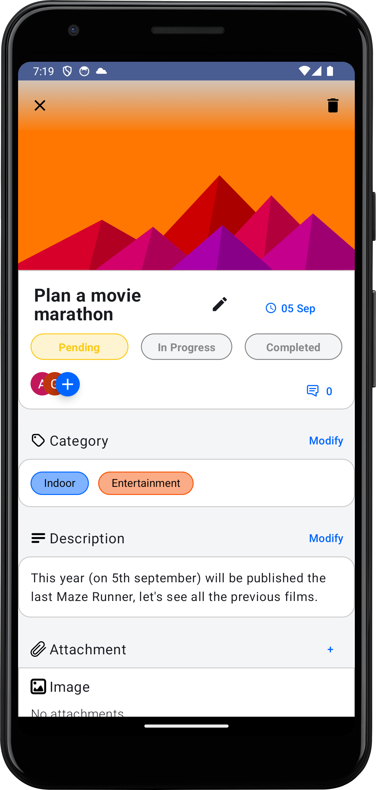
  

- By selecting 'Chat' from the menu, you can see all the team chats we are part of and any potential private chats with individuals. There's the option to search for keywords and create new private chats.
  
  

   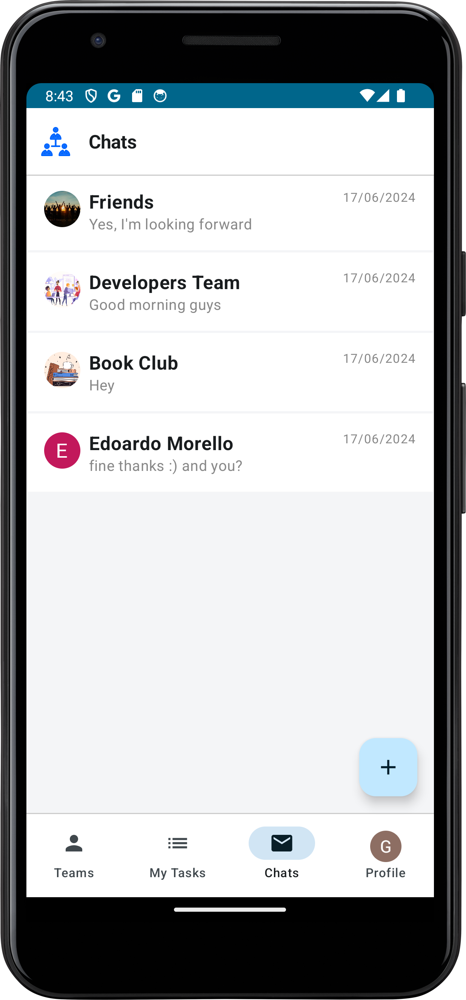
    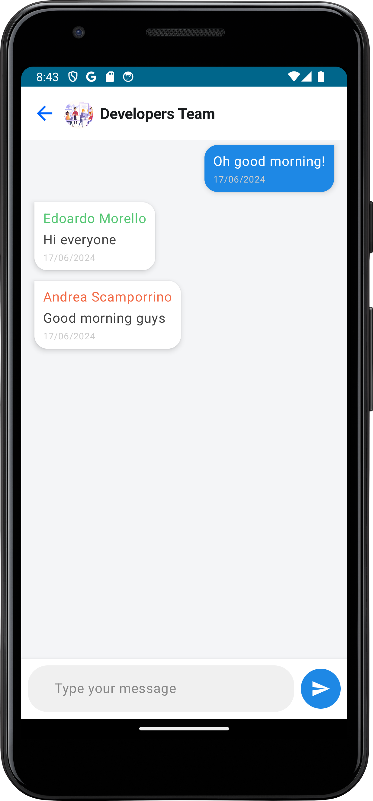
  

- By selecting 'Profile' from the menu, we can see our information, various settings, and achieved goals.

  

    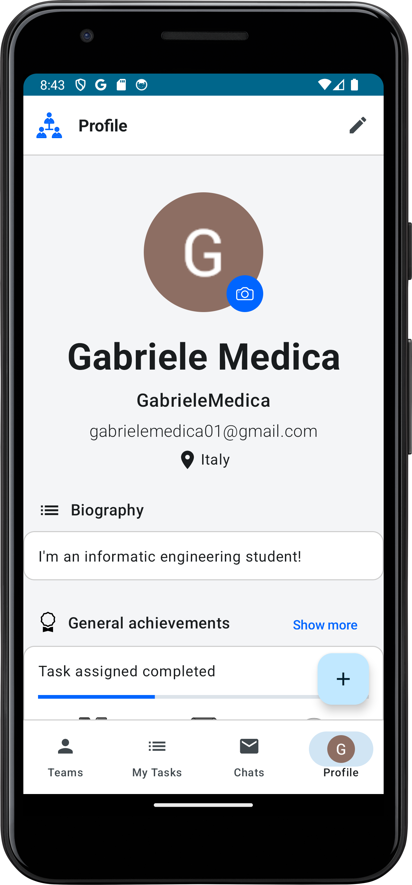
  

